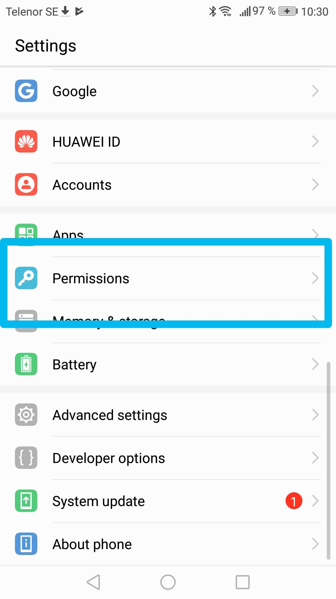
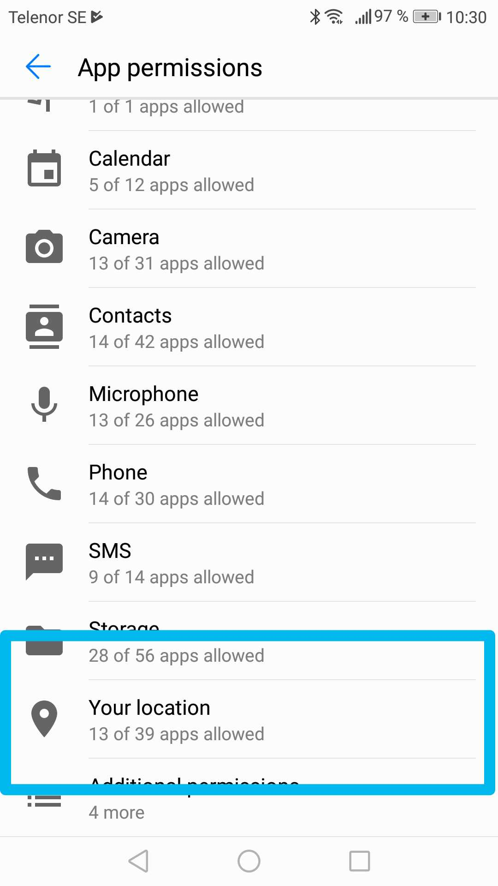
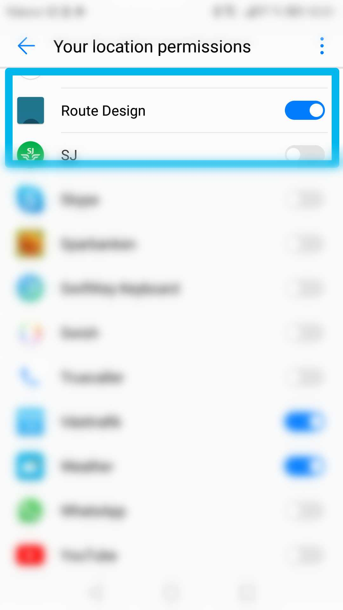

# group-05

## What?
Software that enables the vehicle to follow a user specified route through the use of a smartphone application

## Why?
An interface that enables control of vehicle without programming that can be used for data collection, surveillance of area, automate a path, etc. Many applicable areas where the use of a designed and predetermined route is required.

## How?
### Software:
* Android Studio
* Arduino IDE
* Arduino libraries:
  * <a href="https://github.com/platisd/smartcar_shield">smartcar shield</a> by Dimitris Platis (*)
  * <a href="https://playground.arduino.cc/Code/NewPing/">NewPing</a> by Tim Eckel (*)
  * <a href="http://arduiniana.org/libraries/tinygpsplus/">TinyGPS++</a> by Mikal Hart
  (*) available via Arduino IDE  

### Hardware:
* Arduino Mega
*  <a href="https://github.com/platisd/smartcar_shield/tree/master/extras/eagle/smartcar_shield">PCB Smartcar Shield</a> 
* 4x DC motors
* Bluetooth module
* Sensors:
	* 2x UltraSonicSound Sensor (HC-SR04)
	* Odometer (speed encoders)
	* Gyroscope
	* GPS-module (Neo-6M)
* BETA: Hajken PCB with 3 LEDs and connections for sensors (see: pcb/hajken_cutouts/)

## Setup and get Started!

### Car & Arduino
#### Car / Hardware
* Follow the <a href="https://www.hackster.io/platisd/getting-started-with-the-smartcar-platform-1648ad">instructions</a> for the hardware setup of the smartcar with differential control (aka driving like a tank) 
* Connect front UltraSonicSound Sensor to pin 51 (trigger) and pin 52 (echo) [or other equal free pins]
* Connect right-side UltraSonicSound Sensor to pin 5 (trigger) and pin 6 (echo) [or other equal free pins] (or plugin into pins marked "Sensor right" on Hajken PCB)
* Connect odometer to pin 3 (additional second odometer can be connect to pin 2) (or plugin into pins marked "Odometer right"/"Odometer left" on Hajken PCB)
* Connect Bluetooth module to (hardware) serial 3 [pin 15(RX), 14(TX) - connect RX to TX, TX to RX]
* Connect GPS module to (hardware) serial 1 [pin 19(RX), 18(TX) - connect RX to TX, TX to RX] 
#### Arduino
* Download the repository
* Open hajkenCar.ino in Arduino IDE, download the above-mentioned libraries (via Arduino IDE) and install TinyGPS++ manually (library folder must be called "TinyGPS++")
* Adjust pin setup if necessary. 
* Optional: Test Sensors. Smartcar Shield library includes several sketches to test sensors' functionality.
* Calibrate odometer(s) and gyroscope. Use Smartcar Shield sketches for calibration (Odometer: sensors->odometer->FindPulsesPerMeter / Gyroscope: sensors->odometer->GyroscopeCalibration). Update PULSES_PER_METER and GYRO_OFFSET values.
* Upload sketch to your Arduino.

### Enable the app with permission for location
=======

### Give app permission to use location
The application needs permission to use the phones location.

| <html>   </html> |   <html>   </html> |   <html>   </html> |
 | --- | --- | --- |
| 1. Open Settings. Go to Permissions | 2. Go to Your Location | 3. Enable permission for the app |

### Create an API-key for Google Directions API
For the application to build an API-key is required.  

1. Go to the <a href="https://cloud.google.com/console/google/maps-apis/overview">Google Cloud Platform Console</a> .
2. From the Project drop-down menu, select or create the project for which you want to add an API key.
3. From the  Navigation menu, select APIs & Services > Credentials.
4. On the Credentials page, click Create credentials > API key.
The API key created dialog displays your newly created API key.
5. Create a copy of gradle.properties.no.git and name it gradle.properties
6. Open gradle.properties
7. Find line 15 where it says GoolgeAPIKey = "myKey"
8. Insert your API-key where it says "myKey"
