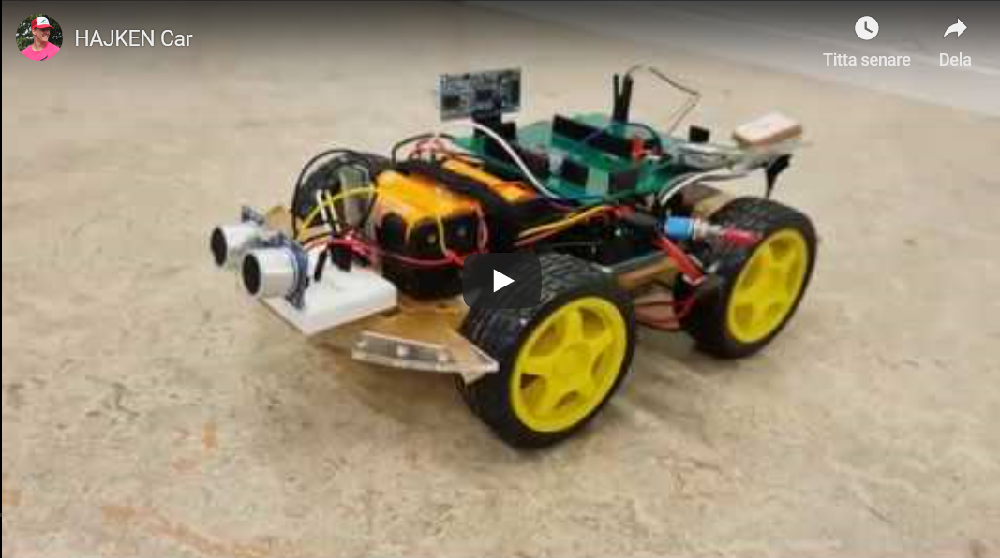

# group-05

<html> <target="_blank" rel="noopener noreferrer" a href="https://youtu.be/X-CesTomLoQ"  </a></html>

## What?
Software that enables the vehicle to follow a user specified route through the use of a smartphone application

## Why?
An interface that enables control of vehicle without programming that can be used for data collection, surveillance of area, automate a path, etc. Many applicable areas where the use of a designed and predetermined route is required. 

## How?
### Software:
* Android Studio
* Arduino IDE
* Libraries:
  * smartcar shield
  * NewPing

### Hardware:
* Arduino Mega
* Arduino Shield
* DC motors
* Bluetooth Module
* Ultrasonicsound Sensor - HC-SR04
* Odometers
* Gyroscope
